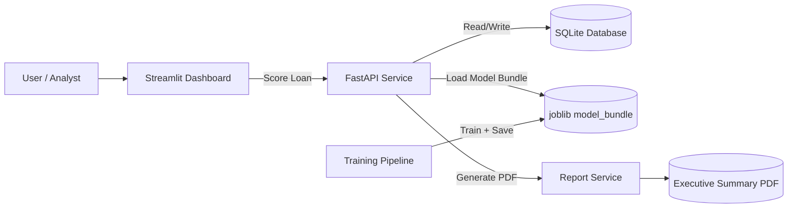

# Mortgage Risk & Retention Analytics Platform


[](#quick-demo)
[](http://127.0.0.1:8000/docs)
[](http://localhost:8501)

A portfolio-ready end-to-end analytics MVP with:
- SQL database (SQLite via SQLAlchemy)
- Python model training + scoring pipeline (scikit-learn)
- REST API (FastAPI)
- Streamlit dashboard
- Model scoring interface (API + dashboard form)
- Auto-generated executive summary PDF report

## Quick Demo

1. In VS Code, open **Run and Debug**.
2. Start **Demo: API + Dashboard** (compound launch).
3. Open API docs: `http://127.0.0.1:8000/docs`.
4. Open dashboard: `http://localhost:8501`.

## Business Framing

Mortgage lenders face revenue leakage due to loan fallout and customer attrition.
This platform predicts:
- Probability of loan fallout
- Customer refinance risk
- Portfolio risk segmentation

Business impact:
- Early intervention workflows
- Targeted retention offers
- Improved underwriting resource allocation
- Executive-ready reporting

## Architecture



## 1) Setup

```bash
python -m venv .venv
.venv\Scripts\activate
pip install -e .
copy .env.example .env
```

## 2) Train Models (optional; API will auto-train if missing)

```bash
python pipelines/train_model.py
```

## 3) Run FastAPI

```bash
uvicorn app.main:app --reload
```

Open docs at `http://127.0.0.1:8000/docs`.

## 4) Run Streamlit Dashboard

```bash
streamlit run dashboard/streamlit_app.py
```

## 5) Core Endpoints

- `GET /health`
- `POST /api/v1/score`
- `GET /api/v1/portfolio/summary`
- `GET /api/v1/report/executive-summary` (returns PDF)
- `GET /api/v1/model/performance`
- `GET /api/v1/model/explainability`
- `POST /api/v1/optimization/underwriter-capacity`

## 6) Model Performance

Performance metrics for the high-risk class are exposed by `GET /api/v1/model/performance`:
- ROC-AUC
- Precision (high-risk class)
- Recall (high-risk class)
- Cross-validated accuracy

Top predictive features include:
- Debt-to-income ratio (`dti`)
- Credit score (`credit_score`)
- Loan-to-value (`ltv`)
- Days in processing (`days_in_processing`)
- Documentation completeness flag (`documentation_completeness_flag`)

## 7) Explainability & Governance

`GET /api/v1/model/explainability` provides:
- SHAP-style values for a sample prediction (linear-model contribution approximation)
- Feature importance values
- Generated feature importance plot (`reports/generated/feature_importance_default.png`)

Model governance summary includes:
- Intended model purpose and usage scope
- Training data provenance (synthetic demo data)
- Known limitations
- Monitoring recommendations for drift/performance

## 8) Optimization Layer

Underwriter capacity optimization is available via:
- `POST /api/v1/optimization/underwriter-capacity`

It simulates threshold policy choices against:
- Risk score cutoffs
- Manual review capacity per underwriter
- Current and maximum staffing constraints

Outputs:
- Recommended risk threshold
- Recommended underwriter staffing level
- Scenario table for operational planning

## 9) Suggested GitHub Repo Highlights

- Include screenshots of API docs, dashboard, and generated PDF.
- Include the architecture diagram shown above.
- Show model assumptions and feature definitions.
- Add roadmap items (auth, CI/CD, cloud deployment, real data connectors).

## 10) Portfolio Screenshots Checklist

- [ ] FastAPI docs page (`/docs`) showing `POST /api/v1/score`.
- [ ] Streamlit dashboard with KPI cards populated.
- [ ] Scoring form submission result with risk/retention metrics.
- [ ] Downloaded executive summary PDF first page.
- [ ] Optional: one chart from the generated report in `reports/generated`.

