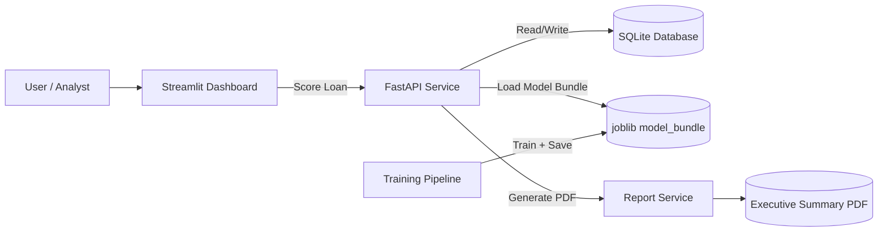

# Mortgage Risk & Retention Analytics Platform


A portfolio-ready end-to-end analytics MVP with:
- SQL database (SQLite via SQLAlchemy)
- Python model training + scoring pipeline (scikit-learn)
- REST API (FastAPI)
- Streamlit dashboard
- Model scoring interface (API + dashboard form)
- Auto-generated executive summary PDF report

## Architecture



## 1) Setup

```bash
python -m venv .venv
.venv\Scripts\activate
pip install -e .
copy .env.example .env
```

## 2) Train Models (optional; API will auto-train if missing)

```bash
python pipelines/train_model.py
```

## 3) Run FastAPI

```bash
uvicorn app.main:app --reload
```

Open docs at `http://127.0.0.1:8000/docs`.

## 4) Run Streamlit Dashboard

```bash
streamlit run dashboard/streamlit_app.py
```

## 5) Core Endpoints

- `GET /health`
- `POST /api/v1/score`
- `GET /api/v1/portfolio/summary`
- `GET /api/v1/report/executive-summary` (returns PDF)

## 6) Suggested GitHub Repo Highlights

- Include screenshots of API docs, dashboard, and generated PDF.
- Include the architecture diagram shown above.
- Show model assumptions and feature definitions.
- Add roadmap items (auth, CI/CD, cloud deployment, real data connectors).

## 7) Portfolio Screenshots Checklist

- [ ] FastAPI docs page (`/docs`) showing `POST /api/v1/score`.
- [ ] Streamlit dashboard with KPI cards populated.
- [ ] Scoring form submission result with risk/retention metrics.
- [ ] Downloaded executive summary PDF first page.
- [ ] Optional: one chart from the generated report in `reports/generated`.

Tip: Save images under `docs/screenshots/` and reference them in this README for a polished recruiter-facing repo.
