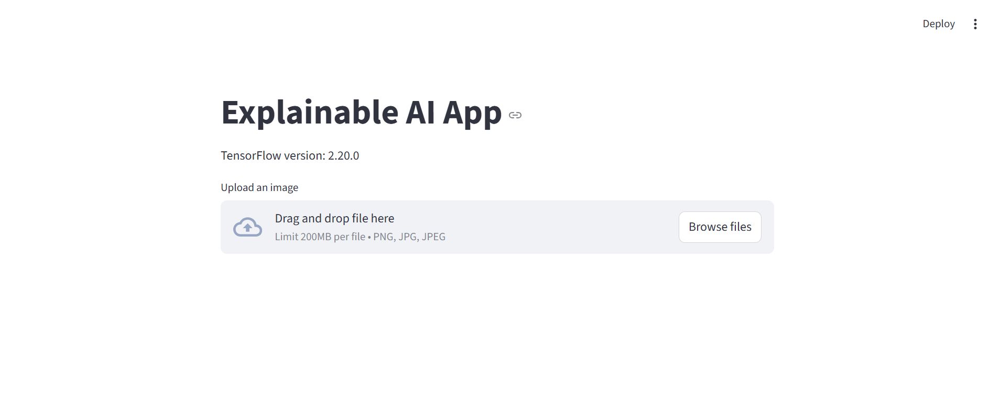

# InsightAI: Interactive Image Classification with Feedback
### An interactive Streamlit app combining CNN predictions, Grad-CAM explanations, BLIP captions, and human-in-the-loop feedback for smarter, interpretable AI.



This project demonstrates an **end-to-end Explainable AI (XAI) system** that goes beyond static image classification. It combines:

- **Deep learning (CNNs)**
- **Explainability (Grad-CAM)**
- **Vision-language models (BLIP)**
- **Human-in-the-loop feedback**
- **Top-3 prediction selection & "Other" class input**
- **Dynamic, user-driven Grad-CAM overlays**
- **An interactive Streamlit web app**

The result is a project that shows not only *model accuracy*, but *model understanding, inspection, and improvement over time*.

---

## Table of Contents

- [InsightAI: Interactive Image Classification with Feedback](#insightai-interactive-image-classification-with-feedback)
    - [An interactive Streamlit app combining CNN predictions, Grad-CAM explanations, BLIP captions, and human-in-the-loop feedback for smarter, interpretable AI.](#an-interactive-streamlit-app-combining-cnn-predictions-grad-cam-explanations-blip-captions-and-human-in-the-loop-feedback-for-smarter-interpretable-ai)
  - [Table of Contents](#table-of-contents)
  - [Project Motivation](#project-motivation)
  - [High-Level System Overview](#high-level-system-overview)
  - [Key Features](#key-features)
  - [Model Architecture](#model-architecture)
    - [CNN Image Classifier](#cnn-image-classifier)
  - [Datasets Used](#datasets-used)
    - [CIFAR-10 (Training)](#cifar-10-training)
    - [User-Provided Images (Inference)](#user-provided-images-inference)
  - [Explainability: Grad-CAM](#explainability-grad-cam)
  - [Vision-Language Integration (BLIP)](#vision-language-integration-blip)
  - [Dynamic Class Mapping](#dynamic-class-mapping)
  - [Installation](#installation)
  - [Tech Stack](#tech-stack)
  - [Why This Project Matters](#why-this-project-matters)
  - [Example Test Session (End-to-End)](#example-test-session-end-to-end)
  - [Author](#author)

---

## Project Motivation

Most entry-level ML projects stop at:
> “Here is my model accuracy.”

This project was intentionally designed to go further and answer:

- **Why did the model make this prediction?**
- **Does the model’s reasoning align with human intuition?**
- **Can users correct the model if predictions are wrong?**
- **How do vision and language models complement each other?**

The goal is to demonstrate *real-world ML system thinking*, not just training a model.

---

## High-Level System Overview

**Pipeline Overview:**

1. User uploads an image
2. CNN predicts image class probabilities
3. Grad-CAM highlights important image regions
4. BLIP generates a natural-language caption
5. Caption keywords map to candidate classes
6. Top-3 predictions are displayed with confidence scores
7. User selects the correct class from top-3 or enters “Other”
8. Grad-CAM overlay dynamically updates to reflect user-selected label
9. Feedback is saved in a persistent mapping store (JSON + CSV)
10. Future predictions benefit from accumulated human knowledge

This simulates how **production ML systems evolve over time**, rather than remaining static.

---

## Key Features

- Interactive Streamlit web interface
- Real-time CNN image classification
- Top-3 prediction confidence display
- Dynamic Grad-CAM heatmap visualization
- BLIP-generated image captions
- Keyword-to-class mapping
- Human-in-the-loop feedback with:
  - Top-3 selection
  - “Other” label input
- Session-safe prediction boosting for selected labels
- Persistent feedback logging for future semantic alignment
- Modular, production-style codebase

---

## Model Architecture

### CNN Image Classifier

- Input shape: `(32, 32, 3)`
- Convolution + MaxPooling blocks
- Dense fully connected layers
- Softmax output layer
- Optimizer: Adam
- Loss: Categorical Crossentropy

**Test Accuracy:** ~73–74% (baseline CIFAR-style CNN)

The model is intentionally kept simple to emphasize **system design and explainability**, not just raw accuracy.

---

## Datasets Used

### CIFAR-10 (Training)

- 60,000 color images
- 10 object classes
- 50,000 training / 10,000 test images
- Images normalized to `[0, 1]`

### User-Provided Images (Inference)

- Arbitrary real-world images
- Automatically resized and normalized
- Used only for inference and feedback (not batch retraining)

---

## Explainability: Grad-CAM

Grad-CAM is used to visualize **where the CNN is “looking”** when making a prediction.

- Heatmap overlay on the original image
- Dynamically updates for the **user-selected label**
- Helps users verify whether the model focuses on meaningful regions
- Useful for detecting spurious correlations or failure modes

This demonstrates practical XAI skills applicable in regulated or high-stakes ML environments.

---

## Vision-Language Integration (BLIP)

A pretrained **BLIP vision-language model** generates a caption describing the uploaded image, such as:

> “a cat and dog sitting on a couch”

This caption provides:

- Semantic context not captured by CIFAR labels
- A bridge between pixel-based vision models and human reasoning
- An additional signal for validating predictions and updating class mappings

---

## Dynamic Class Mapping

BLIP captions are parsed into keywords, which map to possible model classes.

**Example:**

Caption:
"a dog sitting on a couch"

Mapped Classes:
["beagle", "bloodhound", "golden_retriever"]

**User Feedback:**

- Top prediction wrong → selects “Other”: `german_shepherd`
- System updates mapping JSON

**Result:**

- Future images with similar captions improve semantic alignment
- Grad-CAM overlays now reflect user-selected classes
- No model retraining required

---

## Installation

Clone the repository:

```bash
git clone https://github.com/O-S-O-K/explainable-ai-app.git
cd explainable-ai-app
conda create -n xai-app python=3.10
conda activate xai-app
pip install -r requirements.txt
streamlit run app/app.py

## Tech Stack

- Python
- TensorFlow / Keras
- Streamlit
- Grad-CAM (dynamic, user-driven)
- BLIP (Vision–Language Model)
- NumPy, OpenCV, PIL
- JSON + CSV persistence for feedback-driven learning

---

## Why This Project Matters

This project demonstrates skills directly relevant to real-world ML roles:

- Building and training convolutional neural networks
- Applying explainable AI techniques to model predictions
- Integrating vision-language models for semantic understanding
- Designing human-in-the-loop feedback systems
- Handling ambiguous predictions with top-3 selection and “Other”
- Dynamically visualizing user-selected class with Grad-CAM
- Improving model behavior without costly retraining
- Writing modular, production-oriented Python code
- Deploying interactive ML applications with Streamlit

Rather than stopping at model accuracy, this app shows how ML systems can **learn from users over time**, adapt to ambiguity, and become more trustworthy and interpretable.

---

## Example Test Session (End-to-End)

1. User uploads an image of a dog on a couch
2. CNN Prediction:
   - german_shepherd: 74.02%
   - tabby: 1.81%
   - tiger_cat: 1.07%
3. BLIP Caption:
   - "a cat and dog sitting on a couch"
4. Initial BLIP → Class Mapping:
   - ["beagle", "bloodhound", "golden_retriever"]
5. User Feedback:
   - Top prediction wrong → selects “Other”
   - Correct class: `german_shepherd`
6. Grad-CAM overlay updates dynamically for `german_shepherd`
7. System Action:
   - Updates BLIP dynamic mapping file
   - Future images with similar captions improve semantic alignment
8. Result:
   - User-driven explainability and feedback loop
   - No model retraining required

---

## Author

Sheron Schley  
Focus Areas: Data Science, Deep Learning, Explainable AI, Applied Machine Learning Systems
